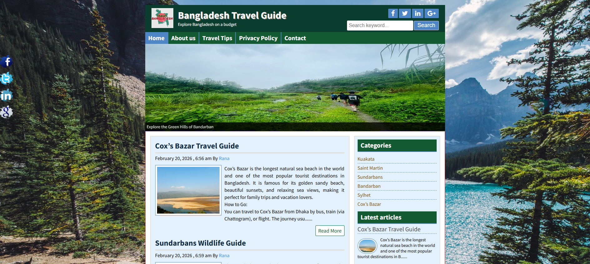
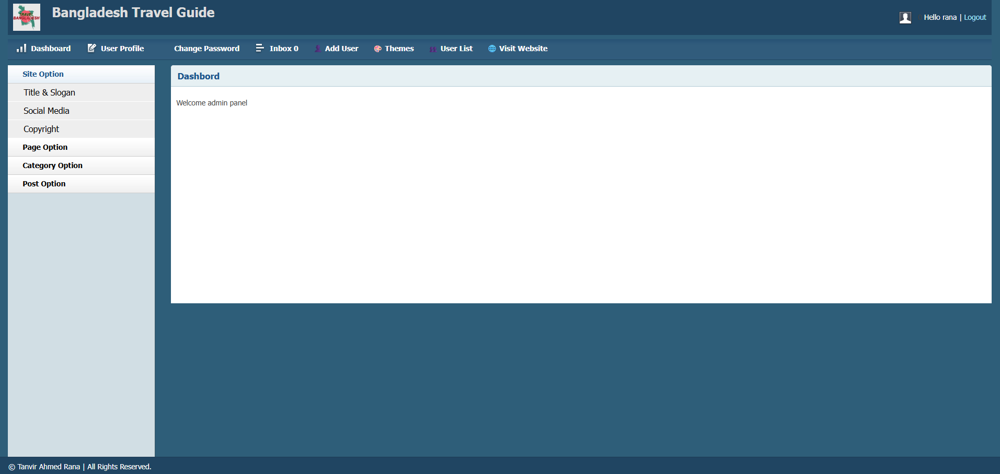

# 🌍 Bangladesh Travel Guide

A dynamic travel blog website developed using **PHP Object Oriented Programming** for showcasing popular tourist destinations of Bangladesh.

This project works as a complete travel guide where users can explore destinations, read travel stories, and discover useful travel information.  
An admin panel is included for managing posts, categories, themes, and website content.

---

## ✨ Features

### 🧭 Front-End
- Travel blog style homepage
- Featured destinations slideshow
- Category based posts (Cox's Bazar, Sundarban, Saint Martin, etc.)
- Search functionality
- Responsive travel-friendly design
- Latest articles sidebar
- Clean travel guide UI

### 🔐 Admin Panel
- Admin login system
- Create / Edit / Delete posts
- Category management
- Theme changer
- User management
- Password recovery via email

---

## 🏝️ Travel Categories Included

- Cox's Bazar
- Sundarban
- Saint Martin
- Bandarban
- Sylhet
- Kuakata

---

## 🛠️ Technologies Used

- PHP (OOP)
- MySQL Database
- HTML5
- CSS3
- JavaScript
- Font Awesome
- XAMPP (Local Development)

---

## Front-End

## Admin Panel

